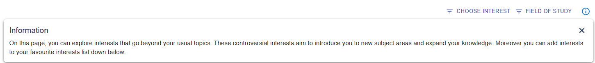
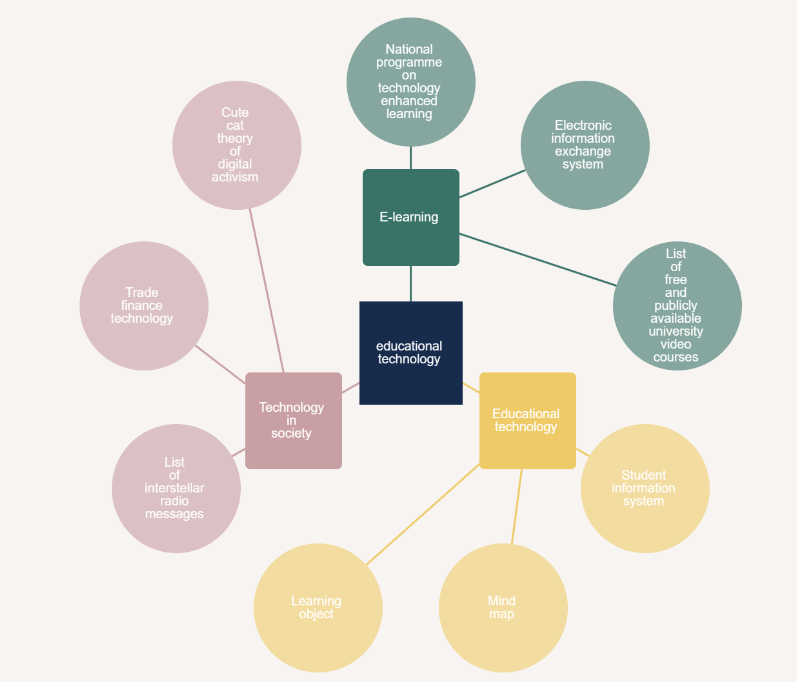
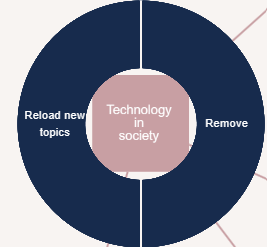
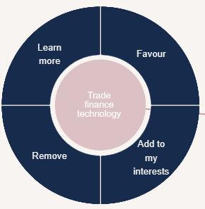
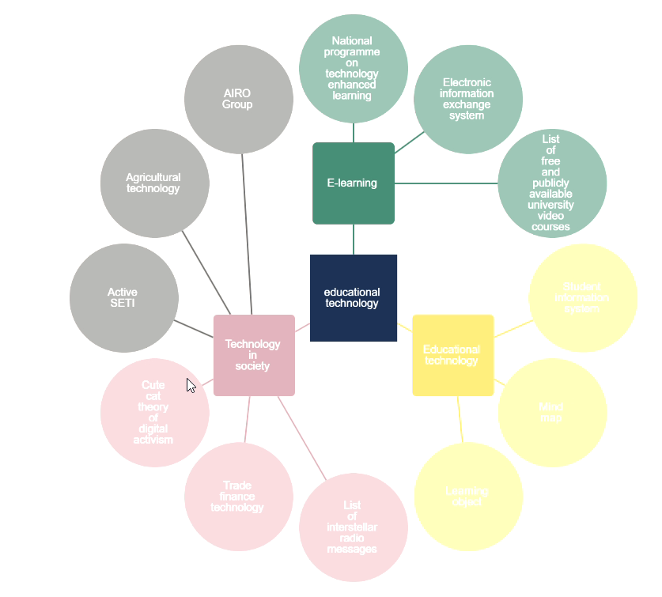
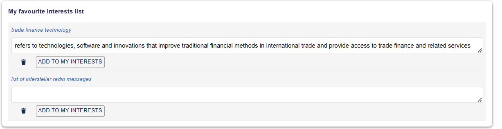
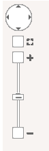
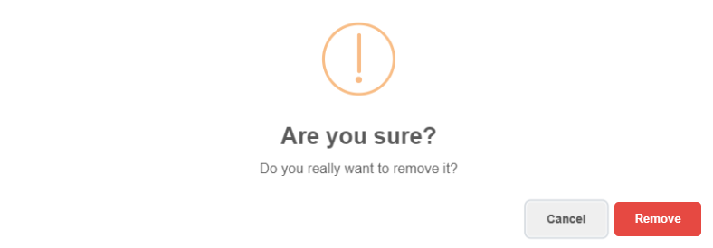

</a>

# Discover - grow your knowledge
During our participation in the Interactive Data Exploration and Analytics (IDEA) lab course, we addressed the question of how to improve the Discover page on the RIMA platform to achieve the self-actualization goal Develop. To accomplish this, we made a variety of improvements to the platform's features based on insights from user experiences. Our work is aimed to help users in discovering new interests and advance  their personal development.

## Project Architecture
### Frontend Components
- **GetNodeLinkDiscover.jsx**: This component was responsible for generating the Node Link Diagram, incorporating visualization-related enhancements and improvements to diagram-related functionalities.
- **Discover.jsx**: This component is in charge of the entire Discover page.
### Backend Component
- **discover.py**: This backend component was employed to generate the data obtained from Wikipedia. 

## Used Libraries
- **Sweetalert**: A JavaScript library utilized for creating custom alert and confirmation dialog boxes.
- **Material-UI**: Employed for button components.
- **Cytoscape**: Employed for zoom panel functionality.

## Implemented changes and Screenshots 
- Information Point

- Node Link Diagram

- Nodes Level 1 and Level 2

- Node Link Diagram after Reload

- Favourite interests List

- Panzoom

- Pop up from Sweetalert

## Group Members
- Mervenur Seyhan
- Helin Bas
- Izem Uyaner

